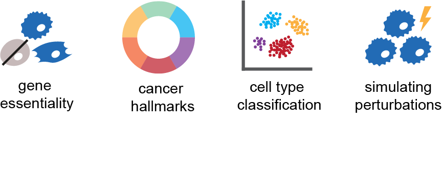

<!-- SETUPTOOLS_LONG_DESCRIPTION_HIDE_BEGIN -->
<p align="center">
  <a href="https://github.com/tahoebio/tahoe-x1">
    <picture>
      <!-- Dark mode -->
      <source media="(prefers-color-scheme: dark)" srcset="./assets/tahoe-white-logo.png">
      <!-- Light mode -->
      <source media="(prefers-color-scheme: light)" srcset="./assets/tahoe-navy-logo.png">
      <!-- Fallback -->
      
    </picture>
  </a>
</p>
<!-- SETUPTOOLS_LONG_DESCRIPTION_HIDE_END -->


<p align="center">
<a href="https://github.com/astral-sh/ruff"></a>
<a href="https://github.com/tahoebio/tahoe-x1/blob/main/LICENSE">
        
    </a>
<a href="https://github.com/psf/black"></a>
</p>
<br />

# Tahoe-x1: Scaling Perturbation-Trained Single-Cell Foundation Models to 3 Billion Parameters

[📄 Paper](http://www.tahoebio.ai/news/tahoe-x1) | [🤗 HuggingFace](https://huggingface.co/tahoebio/Tahoe-x1) | [🚀 Getting Started](#installation) | [🧑‍🏫 Tutorials](tutorials/)

**Tahoe-x1 (Tx1)** is a family of perturbation-trained single-cell foundation models with up to 3 billion parameters, developed by Tahoe Therapeutics.
Tx1 is pretrained on large-scale single-cell transcriptomic datasets including the _Tahoe-100M_ perturbation compendium, and fine-tuned for cancer-relevant tasks.
Through architectural optimizations and efficient training strategies, Tx1 achieves 3–30× higher compute efficiency than prior implementations while delivering state-of-the-art performance across disease-relevant benchmarks.

<picture>
  <source media="(prefers-color-scheme: dark)" srcset="./assets/abstract_logo_dark_mode.png">
  <source media="(prefers-color-scheme: light)" srcset="./assets/abstract_logo_light_mode.png">
  
</picture>

## Table of Contents
- [Repository Structure](#repository-structure)
- [Installation](#installation)
- [Training Infrastructure](#training-infrastructure)
- [Datasets](#datasets)
- [Pre-trained Models](#pre-trained-models)
- [Training and Fine-tuning](#training-and-fine-tuning)
- [Generating Cell and Gene Embeddings](#generating-cell-and-gene-embeddings)
- [Tutorials and Benchmarks](#tutorials-and-benchmarks)
- [Developer Guidelines](#developer-guidelines)
- [Acknowledgements](#acknowledgements)
- [License](#license)

## Repository Structure

This repository follows a similar structure to [llm-foundry](https://github.com/mosaicml/llm-foundry/tree/main) and imports several utility functions from it.

```
tahoe-x1/
├── tahoe_x1/                    # Core Tahoe-x1 library
│   ├── model/
│   │   ├── blocks/           # Building block modules used across models
│   │   └── model/            # Full architecture subclassed from ComposerModel
│   ├── tasks/                # Helper functions for downstream tasks
│   ├── tokenizer/            # Vocabulary building and tokenization functions
│   ├── data/                 # Data loaders and collators
│   └── utils/                # Utility functions 
├── scripts/
│   ├── train.py              # Training script
│   ├── depmap/               # DepMap benchmark scripts
│   ├── msigdb/               # MSigDB pathway benchmark scripts
│   ├── state_transition/     # State transition prediction scripts
│   ├── data_prep/            # Dataset preparation scripts
│   └── inference/            # Inference utilities
|       ├──predict_embeddings.py            # Embedding extraction script
│       └──prepare_for_inference.py         # Prepares model for inference
├── tutorials/                # Jupyter notebook tutorials
│   ├── clustering_tutorial.ipynb  # Cell clustering and UMAP visualization
│   └── training_tutorial.ipynb    # Training walkthrough
└── configs/                      
    ├──runai/                 # RunAI configuration files
    ├──mcli/                  # MosaicML platform configuration files
    ├──gcloud/                # Google Cloud configuration files
    └──test_run.yaml          # Sample config file
```

## Installation

Docker installation provides better reproducibility and avoids dependency conflicts.

### Docker Installation (Recommended)

```bash
# Clone the repository
git clone https://github.com/tahoebio/tahoe-x1.git
cd tahoe-x1

# Pull the latest Docker image with all the dependencies pre-installed
docker pull ghcr.io/tahoebio/tahoe-x1:latest

# Start an interactive container with GPU support
# Note that nvidia-container-toolkit is required for this step
docker run -it --rm \
  --gpus all \
  -v "$(pwd)":/workspace \
  -w /workspace \
  ghcr.io/tahoebio/tahoe-x1:latest\
  /bin/bash

# Inside the container, install the Tahoe-x1 package (dependencies are pre-installed)
pip install -e . --no-deps
```

The Docker image includes all necessary dependencies including PyTorch, CUDA drivers, and flash-attention for optimal performance.

### Native Installation (Alternative)

For direct installation without Docker, we recommend using `uv` for dependency management:

```bash
# Clone the repository
git clone https://github.com/tahoebio/tahoe-x1.git
cd tahoe-x1

# Install uv if not already installed
curl -LsSf https://astral.sh/uv/install.sh | sh

# Create and activate virtual environment
uv venv
source .venv/bin/activate

# Install the package with dependencies
uv pip install -e . --no-build-isolation-package flash-attn
```

**Note**: Native installation requires compatible CUDA drivers and may encounter dependency conflicts. Docker installation is recommended for the best experience.


## System Requirements & Training Capabilities

Tahoe-x1 is built natively on [Composer](https://github.com/mosaicml/composer) and [llm-foundry](https://github.com/mosaicml/llm-foundry), inheriting their full suite of large-scale training capabilities:

### Hardware Requirements
- **GPU**: NVIDIA Ampere (A100) or newer for FlashAttention support
- **CUDA**: Version 12.1+
- **Python**: 3.10+

### Advanced Training Features
The codebase leverages Composer's state-of-the-art training stack, configurable via YAML:
- **Automatic micro-batching** for optimal memory utilization
- **Mixed precision training** with BF16/FP16, plus FP8 support on Hopper (H100) and newer GPUs
- **Multi-GPU and multi-node** distributed training with FSDP (Fully Sharded Data Parallel)
- **Gradient accumulation and checkpointing** for training larger models on limited hardware
- **Advanced optimizers and schedulers** from the LLM training ecosystem
- **Streaming datasets** for efficient data loading at scale

This infrastructure supports training models from 70M to 3B parameters and can scale to larger architectures.

### Docker Images

We provide pre-built Docker images for ease of use:

| Image Name | Base Image | Description |
|------------|------------|-------------|
| [`ghcr.io/tahoebio/tahoe-x1:1.0.0`](https://github.com/tahoebio/tahoe-x1/pkgs/container/tahoe-x1) | `mosaicml/llm-foundry:2.2.1_cu121_flash2-813d596` | Current release image for Tahoe-x1 |

## Datasets

Tx1 was pretrained on 266 million single-cell profiles from three major sources. The following datasets were used for training and evaluation:

| Dataset | Description | Usage | Location |
|---------|-------------|-------|----------|
| **CellxGene 2025-01** | ~61M  cells  from Jan 2025 CellxGene release | Tx1-3B stage 1 Pre-training  | `s3://tahoe-hackathon-data/MFM/cellxgene_2025_01_21_merged_MDS/` |
| **scBaseCamp 2025-02** | ~112M  cells from Feb 2025 scBaseCamp release | Tx1-3B stage 1 Pre-training | `s3://tahoe-hackathon-data/MFM/scbasecamp_2025_02_25_MDS_v2/` |
| **Tahoe 100M** | ~96M  cells from Tahoe-100M | Tx1-3B stage 1 Pre-training | `s3://tahoe-hackathon-data/MFM/tahoe_100m_MDS_v2/` |
| **filtered CellxGene 2025-01** | ~43M filtered cells  from Jan 2025 CellxGene release | Tx1-3B stage 2 Pre-training  | `s3://tahoe-hackathon-data/MFM/cellxgene_2025_01_21_merged_MDS_filtered/` |
| **filtered scBaseCamp 2025-02** | ~76M filtered cells from Feb 2025 scBaseCamp release | Tx1-3B stage 2 Pre-training | `s3://tahoe-hackathon-data/MFM/scbasecamp_2025_02_25_MDS_v2_filtered/` |
| **filtered Tahoe 100M** | ~34M filtered cells from Tahoe-100M | Tx1-3B stage 2 Pre-training | `s3://tahoe-hackathon-data/MFM/tahoe_100m_MDS_v2_filtered/` |
| **DepMap** | Cancer cell line dependency data | DepMap Benchmark | `s3://tahoe-hackathon-data/MFM/benchmarks/depmap/` |
| **MSigDB** | Pathway signature data | MsigDB Benchmark | `s3://tahoe-hackathon-data/MFM/benchmarks/msigdb/` |

Filtered versions of the pre-training datasets above exclude cells with very few expressed genes and are used for stage 2 pre-training of Tx1-3B.

Public access to datasets: `s3://tahoe-hackathon-data/MFM/benchmarks/`

If you require access to datasets not available in the public bucket, please open a GitHub issue or contact the team.

For more information on dataset preparation, see [scripts/data_prep/README.md](scripts/data_prep/README.md).


## Pre-trained Models

We provide pre-trained Tahoe-x1 models of various sizes:

| Model Name | Parameters | Context Length | Checkpoint Path | WandB ID | Config File |
|------------|------------|----------------|-----------------|----------|-------------|
| **Tx1-3B** | 3B | 2048  | `s3://tahoe-hackathon-data/MFM/ckpts/3b/` | [mygjkq5c](https://wandb.ai/vevotx/tahoe-x1/runs/mygjkq5c) | `./configs/mcli/tahoe_x1-3b-v2-cont-train.yaml` |
| **Tx1-1.3B** | 1.3B | 2048 | `s3://tahoe-hackathon-data/MFM/ckpts/1b/` | [26iormxc](https://wandb.ai/vevotx/tahoe-x1/runs/26iormxc) | `./configs/gcloud/tahoe_x1-1_3b-merged.yaml` |
| **Tx1-70M** | 70M | 1024 | `s3://tahoe-hackathon-data/MFM/ckpts/70m/` | [ftb65le8](https://wandb.ai/vevotx/tahoe-x1/runs/ftb65le8) | `./configs/gcloud/tahoe_x1-70m-merged.yaml` |

Model weights are also available as safetensor files on our  [🤗 Huggingface model card](https://huggingface.co/tahoebio/Tahoe-x1).

## Training and Fine-tuning

### Training from Scratch

You can start with `configs/test_run.yaml`, which is a sample configuration showing how to train the 70M model on the Tahoe100M dataset for a few iterations. Customize this configuration file for your own training runs.

Use the main training script with a YAML configuration file: 

```bash
composer scripts/train.py -f configs/test_run.yaml
```

Or with command-line arguments:

```bash
composer scripts/train.py \
  --model_name tahoe_x1 \
  --data_path /path/to/data \
  --max_seq_len 2048 \
  --batch_size 32
```

Note that the current codebase only supports `attn_impl: flash` and `use_attn_mask: False`. The Triton backend and custom attention masks (used for training Tx1-1B and Tx1-70M) are no longer supported. If you have questions about using custom attention masks with the Triton backend, please contact us.

### Fine-tuning

To fine-tune a pre-trained model on your own data:

1. Download a pre-trained checkpoint from S3
2. Modify the training configuration to load from checkpoint
3. Prepare your dataset in the MDS format (see [scripts/data_prep/README.md](scripts/data_prep/README.md))
4. Launch training with the `--load_path` argument

```bash
python scripts/train.py \
  -f configs/finetune_config.yaml \
  --load_path s3://path/to/checkpoint
```

### Launching runs on different platforms
For launching runs on specific platforms such as MosaicML, Google Cloud, or RunAI, refer to the corresponding configuration folders under `configs/` and their respective README files.

### Preparing Models for Inference

Package a trained model with its vocabulary and metadata by editing the configuration section in the script:

1. Open `scripts/inference/prepare_for_inference.py` and update the configuration variables:
   - `model_name`: Your model name (e.g., `"tx-3b-prod"`)
   - `wandb_id`: Your WandB run ID (e.g., `"mygjkq5c"`)
   - `wandb_project`: Your WandB project name (e.g., `"vevotx/tahoex"`)
   - `save_dir`: Output directory path
   - `default_vocab_url`: S3 URL for vocabulary file (e.g., `"s3://tahoe-hackathon-data/MFM/vevo_v2_vocab.json"`)

2. Run the script:
```bash
python scripts/inference/prepare_for_inference.py
```

The script will download the model config from WandB, process the vocabulary, and save inference-ready files to your specified output directory.


## Generating Cell and Gene Embeddings

### Quick Start with Inference Script

Extract cell embeddings from an AnnData object:

```python
from omegaconf import OmegaConf as om
from scripts.inference.predict_embeddings import predict_embeddings

cfg = {
    "model_name": "Tx1-70m",
    "paths": {
        "hf_repo_id": "tahoebio/Tahoe-x1",
        "hf_model_size": "70m",
        "adata_input": "/path/to/your_data.h5ad",
    },
    "data": {
        "cell_type_key": "cell_type",
        "gene_id_key": "ensembl_id"
    },
    "predict": {
        "seq_len_dataset": 2048,
        "return_gene_embeddings": False,
    }
}

cfg = om.create(cfg)
adata = predict_embeddings(cfg)

# Access embeddings
cell_embeddings = adata.obsm["Tx1-70m"]
```

### Extracting Gene Embeddings

Set `return_gene_embeddings: True` in the configuration to extract gene-level representations.


## Tutorials and Benchmarks

### Tutorials
- **[Clustering Tutorial](tutorials/clustering_tutorial.ipynb)**: Cell clustering and UMAP visualization
- **[Training Tutorial](tutorials/training_tutorial.ipynb)**: Step-by-step guide to training Tahoe-x1 models


### Benchmarks

Tx1 achieves state-of-the-art performance across disease-relevant benchmarks. See our [preprint](http://www.tahoebio.ai/news/tahoe-x1) for detailed results.

| Benchmark | Task | Code Location |
|-----------|------|---------------|
| **DepMap Essentiality** | Predict broad and context-specific gene dependencies | [`scripts/depmap/`](scripts/depmap/) |
| **MSigDB Hallmarks** | Recover 50 hallmark pathway memberships from gene embeddings | [`scripts/msigdb/`](scripts/msigdb/) |
| **Cell-Type Classification** | Classify cell types across 5 tissues (Tabula Sapiens 2.0) | [`cz-benchmarks`](https://github.com/chanzuckerberg/cz-benchmarks) |
| **Perturbation Prediction** | Predict transcriptional responses in held-out contexts | [`scripts/state_transition/`](scripts/state_transition/) |


### Additional Resources
- **Data Preparation**: [scripts/data_prep/README.md](scripts/data_prep/README.md)
- **Platform Usage**: [mcli/README.md](mcli/README.md) and [gcloud/README.md](gcloud/README.md)

## Troubleshooting

### Common Issues and Solutions

- **PyTorch/CUDA mismatch**: Ensure PyTorch is installed with the correct CUDA version for your system
- **Docker permission denied**: Run Docker commands with `sudo` or add your user to the docker group
- **OOM (Out of Memory)**: Ensure half-precision, flash-attention are enabled, set microbatch_size to auto
- **S3 access denied**: For public buckets, the code will automatically retry with unsigned requests


For additional help, please open an issue on [GitHub](https://github.com/tahoebio/tahoe-x1) with:
- Your system configuration (OS, GPU, PyTorch version)
- Complete error message and stack trace
- Steps to reproduce the issue

## Acknowledgements
We thank the developers of the following open-source projects:
- **[scGPT](https://github.com/bowang-lab/scGPT/tree/main)**: For inspiring the Tahoe-x1 architecture
- **[llm-foundry](https://github.com/mosaicml/llm-foundry)**: Efficient training infrastructure for large language models
- **[streaming](https://github.com/mosaicml/streaming)**: Fast, efficient dataset streaming
- **[CZ CELLxGENE](https://cellxgene.cziscience.com/)**: Chan Zuckerberg Initiative's single-cell atlas
- **[Arc scBaseCount](https://github.com/ArcInstitute/arc-virtual-cell-atlas/)**: Arc Institute's virtual cell atlas
- **[Arc Institute STATE](https://github.com/arcinstitute/state)**: State Transition model for perturbation prediction
---

For questions, issues, or collaboration inquiries, please open an issue on [GitHub](https://github.com/tahoebio/tahoe-x1) or write to us at [admin@tahoebio.ai](mailto:admin@tahoebio.ai).
