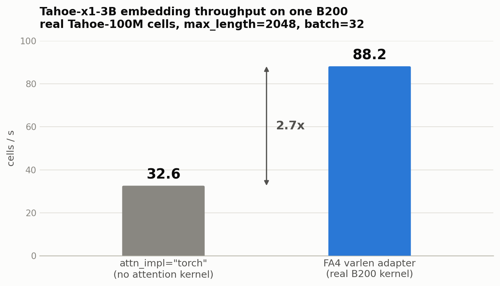
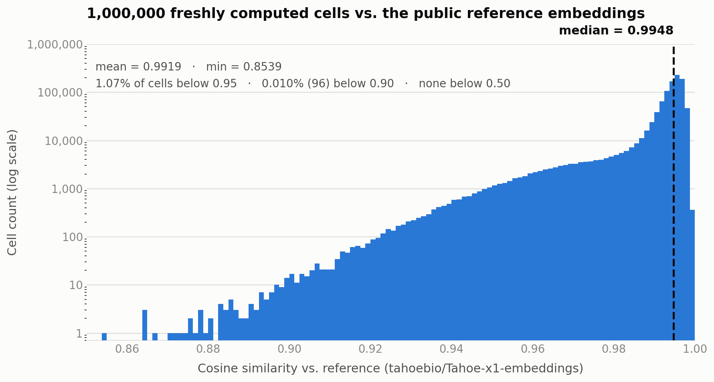

# Flash-Attention-4 on B200: Inference Optimization & Validation

**Repo:** `tahoe_x1`
**Scope:** `scripts/inference/save_embeddings.py`, `scripts/inference/compare_embeddings.py`, `tahoe_x1/_flash_attn_compat.py`
**Model:** Tahoe-x1-3B (`tahoebio/Tahoe-x1`), 2.72B params, d_model=2560, 32 layers
**Hardware:** 1x NVIDIA B200

## Summary

On Blackwell (B200), flash-attn-4 is the only installable option — the only
flash-attn variant with real Blackwell kernels — but its API doesn't match what this
codebase's attention layer (via llm-foundry) expects. A prior compat shim made imports
work by falling back to `attn_impl="torch"` — no real attention kernel at all, and (as
§2.1 shows) not even a faithful reference on padded batches. This report covers the fix
that got real hardware acceleration working, the profiling that motivated it, and a
large-scale correctness check against the existing public reference embeddings.

**Net result: 32.6 -> 88.2 cells/s (~2.7x) and peak memory 44.6 -> 21.8 GiB (about
half)**, measured on real Tahoe-100M batches, and validated against 1,000,000 real
cells at a median cosine similarity of **0.9948** to the public reference dataset.

---

## 1. The problem

FA4 (`flash-attn-4` on PyPI, importable as `flash_attn`) is Dao-AILab's CuTeDSL
rewrite, built for newest-generation GPUs. It's the *only* flash-attn variant with
real Blackwell (sm_100) kernels — classic flash-attn v2/v3 don't support compute
capability >=10 at all, and this repo's own Docker image
(`mosaicml/llm-foundry:2.2.1_cu121_flash2-813d596`, CUDA 12.1) is a dead end for B200
regardless of any Dockerfile change. So the base image was never the fixable part;
the problem was purely API-level.

FA4 ships only `flash_attn.cute.*` — no top-level `__version__`, no
`flash_attn.bert_padding` — while llm-foundry's attention code (which `tahoe_x1`
builds on) expects the classic flash-attn v1/v2 surface unconditionally at import
time. The existing `tahoe_x1/_flash_attn_compat.py` shim patched just enough of that
surface for `import tahoe_x1` to succeed, but paired it with `attn_impl: "torch"` — an
O(seq_len^2)-memory fallback with no CUDA attention kernel at all.

## 2. What was built

### 2.1 FA4 varlen adapter

llm-foundry calls `flash_attn_interface.flash_attn_varlen_func(q, k, v, cu_seqlens_q,
cu_seqlens_k, max_seqlen_q, max_seqlen_k, dropout_p, softmax_scale, causal,
window_size, ...)` on packed `(total, nheads, headdim)` tensors. FA4's
`flash_attn.cute.flash_attn_varlen_func` turned out to have an almost identical
signature — same parameter names, same tensor convention — differing only in dropout
(unsupported; fine, since eval always uses `dropout_p=0.0`) and return shape
(`(output, lse)` tuple vs. a bare tensor). A thin wrapper bridges the two, so
`attn_impl: "flash"` now runs on a real Blackwell kernel instead of falling back to
`"torch"`.

**Verified:** attention output matched a naive PyTorch reference (padded/varlen input)
to bf16 tolerance; full 32-layer model CLS embeddings, `attn_impl="torch"` vs
`"flash"`, cosine similarity > 0.9999 **on unpadded rows**.

That qualifier matters, and it is a property of the `"torch"` fallback rather than of
this adapter: `"torch"` never masks padding. The flash path derives padding from
`cu_seqlens`, while the torch path can only get it from `attn_bias`, which is built
only under `use_attn_mask: true` — a code path that is broken independently of any of
this (`_make_mask` returns `(B, S, S)`, which `blocks.py` unsqueezes to 5-D and torch
attention rejects), which is why every shipped config sets it `false`. So on a batch
with padded rows the two implementations legitimately disagree — measured cosine mean
0.58 on a batch with 28 of 32 rows padded, ~1.0 for the full-length rows only. Treat
`"torch"` as a throughput baseline, not a correctness oracle; the correctness evidence
that matters is §4, which compares against the published reference embeddings and does
not involve the torch path at all.

### 2.2 A padding fast path that did not survive real data

Profiling the FA4-accelerated model showed attention at only ~9% of GPU time and dense
matmuls at ~47%, but llm-foundry's *unconditional* unpad -> flash -> pad round trip
(`bert_padding` gather/scatter) at ~17%. That looked like free headroom: on a batch
with no padding, the round trip is pure overhead, so it could be skipped by calling
FA4's fixed-length `flash_attn.cute.flash_attn_func` directly.

It was built, and it works — but it almost never applies. The collator pads each batch
to the longest cell in it (`min(max_length, max_cell_len)`), and real Tahoe-100M cells
carry roughly 565-2048 expressed genes, so from `batch_size=4` upward essentially every
batch contains a short row and therefore padding:

| batch_size | batches sampled | fully unpadded | fast path eligible |
|---|---|---|---|
| 1 | 512 | 512 | 100% |
| 2 | 256 | 3 | 1.2% |
| 4, 8, 16, 32, 64 | 128 - 8 | 0 | **0%** |

At the batch sizes inference actually runs at, the hit rate is zero, and end-to-end
throughput with the fast path registered was identical to without it (88.2 cells/s
both ways, to three significant figures). The code was therefore removed rather than
shipped as a path that never executes. The ~17% is still on the table — see §5.

## 3. Benchmarks

3B model, `max_length=2048`, batch=32, one B200, real Tahoe-100M cells (512 cells,
pre-materialized so the numbers measure GPU work and not the HF stream).

| stage | cells/s | peak mem |
|---|---|---|
| `attn_impl="torch"` (baseline) | 32.6 | 44.6 GiB |
| + FA4 varlen adapter | 88.2 | 21.8 GiB |

Both rows do the same amount of work on the same batches, so this is a fair throughput
and memory comparison; per §2.1 it is not a correctness comparison.

Profiling the accelerated model showed GEMM (`addmm`) as the dominant remaining cost,
attention itself only ~9%, and the rest (residual adds, GELU, LayerNorm, dtype copies,
and the `bert_padding` round trip) making up the remainder. GEMM is both the largest
*and* already near-optimal cost on tuned tensor-core kernels — there's little headroom
left on BF16 without a precision change (FP8 would be the next lever, untried so far).

The §4 validation run corroborates this at scale rather than on a 512-cell sample:
1,000,000 streamed cells embedded in 3 h 14 m, i.e. **85.9 cells/s sustained** end to
end, HF streaming and all — within 3% of the 88.2 cells/s measured on pre-materialized
batches. So the data path is not the bottleneck at this scale; the GPU is.

Full Tahoe-100M corpus estimate on one GPU: ~36 days -> ~13 days. Multi-GPU (already
supported by `save_embeddings.py` via `torchrun`/`composer`) is the next lever for the
real production run, not more single-GPU tuning.

## 4. Validating against the existing reference embeddings

Re-embedding the full 100M-cell corpus wasn't necessary — `tahoebio/Tahoe-x1-embeddings`
already exists as a public reference. Instead, `compare_embeddings.py` computes fresh
embeddings for N cells (this run: 1,000,000) with the optimized pipeline above, and
checks them against that reference.

Cells are matched by `BARCODE_SUB_LIB_ID`, not row position — the reference dataset's
own README makes no ordering guarantee between it and Tahoe-100M. Two real bugs
surfaced building this and were fixed, not just anticipated:

- The reference dataset's parquet files declare a `"List"` feature type this repo's
  `datasets==3.6.0` doesn't recognize (`ValueError: Feature type 'List' not found`) --
  even via the reference README's own suggested workaround. Fixed by reading with raw
  `pyarrow` instead, which ignores that schema metadata entirely.
- Tahoe-100M is sharded across thousands of files (4,419 as of writing, and growing);
  `load_dataset(..., split="train[:N]")` downloads *all* of them before slicing,
  regardless of how small N is. Fixed with streaming + `.take(N)`, which reads
  incrementally instead.

### Result: 1,000,000 cells

Every one of the 1,000,000 requested cells matched a reference barcode successfully —
itself a strong validation that the pipeline's row handling and the two datasets'
identity are consistent at full scale, not just on a small smoke test. The run took
3 h 30 m wall clock on one B200: 3 h 14 m embedding, then ~15 m to scan the reference
shard and match barcodes.

| stat | value |
|---|---|
| mean | 0.9919 |
| median | 0.9948 |
| std | 0.0093 |
| min | 0.8539 |
| p1 / p5 | 0.9491 / 0.9720 |
| p95 / p99 | 0.9975 / 0.9981 |

Only **1.07%** of cells (10,744) fall below 0.95 similarity, and just **0.010%**
(96 cells) fall below 0.90. None fall below 0.5. Sub-1.0 similarity is expected here,
not a bug: the collator does random gene subsampling (`sampling: true`), so even
re-running the *original* pipeline on itself wouldn't hit exactly 1.0.

**One thing worth a look, not an alarm:** the worst-matching cells cluster heavily
around a `67_...` barcode prefix (a specific plate/sub-library) rather than being
randomly scattered. Of the 1,000 lowest-similarity cells, 19.7% carry that prefix
against a 1.0% share of the million sampled — a ~20x enrichment. That shape suggests a
batch-specific quirk rather than a pipeline bug, but it has not been investigated.

## 5. Open follow-ups

- **Multi-GPU** is the real next lever for the full-corpus production run — GEMM is
  already compute-bound on tuned kernels, so more single-GPU tuning has limited room
  left.
- **`use_attn_mask` is broken** (`_make_mask`'s `(B, S, S)` return becomes a 5-D
  `attn_bias`). Pre-existing and sidestepped by every config setting it `false`, but it
  is the reason `attn_impl: "torch"` cannot mask padding. Worth a small fix on its own.
- **FP8** would cut the now-dominant GEMM cost further (B200 FP8 is ~2x BF16 dense
  TFLOPs), but needs real engineering (torchao or similar) plus accuracy validation
  against this same reference dataset before trusting it for a production run.
- **Length-bucketed batching** is what would make the §2.2 idea pay off: group cells of
  similar gene count into a batch and the padding largely disappears, which both shrinks
  wasted attention work and makes a no-padding fast path viable for the ~17% of GPU time
  still spent in the `bert_padding` round trip. It changes which cells share a batch, so
  it needs its own correctness re-validation.
- No deployed tahoe_x1 checkpoint currently uses real GQA (the 3B has
  `kv_nheads == n_heads == 20`), and FA4's kernels handle GQA natively, so nothing in
  this shim special-cases it.
- The `67_...` barcode outlier cluster in section 4 is unexplained — worth a quick
  look if the affected plate/sub-library matters for downstream use.
